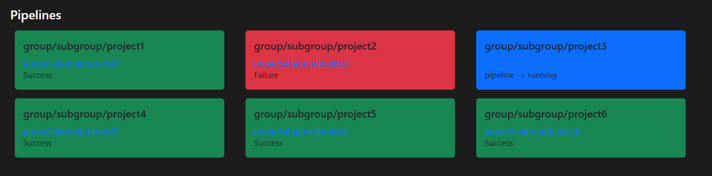

# GitLab Build Monitor View
This app is a simple web application that connects to a GitLab instance and displays the status of pipelines.

### Technologies Used
- **Kotlin**
- **Spring Boot**
- **Kotlin Gradle**
- **Thymeleaf**
- **Bootstrap**
- **gitlab4j**

### Features
Displays the status of pipelines in a responsive grid of rectangles with round edges.
Each rectangle represents a pipeline, and its background color indicates whether the pipeline was successful or not.
You can click on the pipeline name to navigate to the pipeline's page in GitLab.

### Usage
- Clone the repository and run the spring boot application.
- Set the gitlabbuildmonitorview.personal-access-token in application.properties to your GitLab personal access token.
    - Personal access token can be found in the GitLab profile settings => Access Tokens.
    - The token must have the _api_ scope or _read_api_ scope.
- Open your browser and navigate to http://localhost:8101

### Build a Docker image
Run ./gradlew bootBuildImage in the root directory.

### Environment variables:
GITLABBUILDMONITORVIEW_HOST=https://gitlab.com  
GITLABBUILDMONITORVIEW_PERSONAL_ACCESS_TOKEN=  
GITLABBUILDMONITORVIEW_PROJECTS=group/subgroup/project1,group/subgroup/project2  

### Limitations
Current limitation is that the app may have slow response time when connecting to GitLab due to network latency or
high traffic on the GitLab instance.
